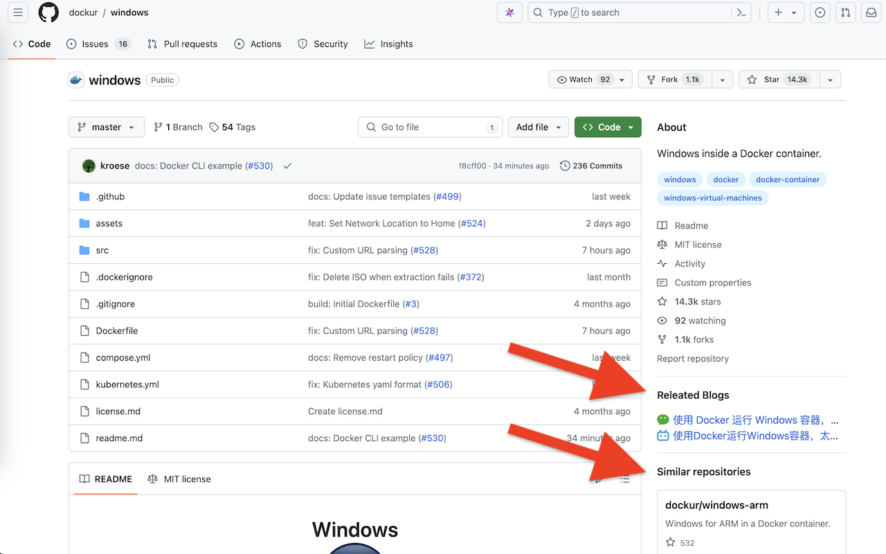

# GitHub Linker Extension

data-canonical-src="https://user-images.githubusercontent.com/23217571/183360309-4ae85889-de22-4360-b946-3e79d019ba69.jpg" width="200" height="200" />

This is an official repo for <a href="https://chromewebstore.google.com/detail/github-linker/onibhfpjiiendmejmgccflkcjhifgbgn">GitHub Linker extension</a>

<h2>Screenshots</h2>

