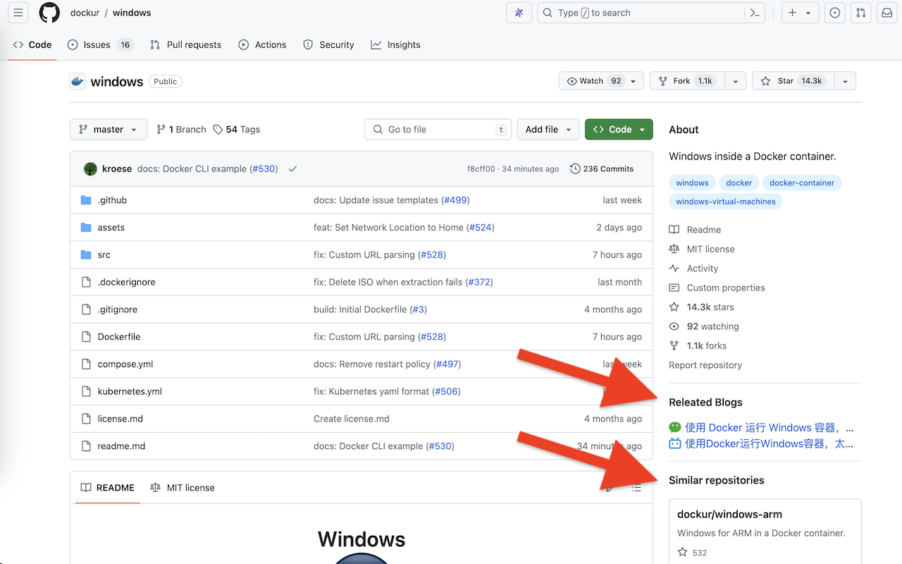
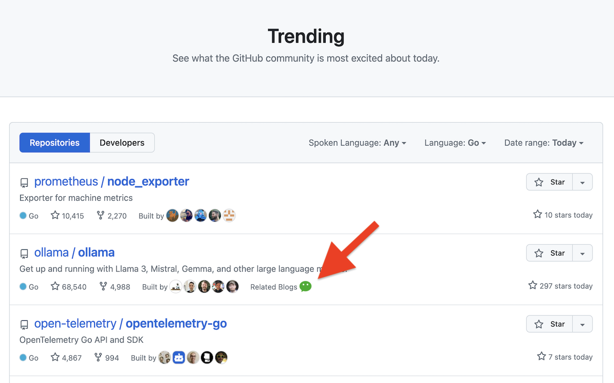
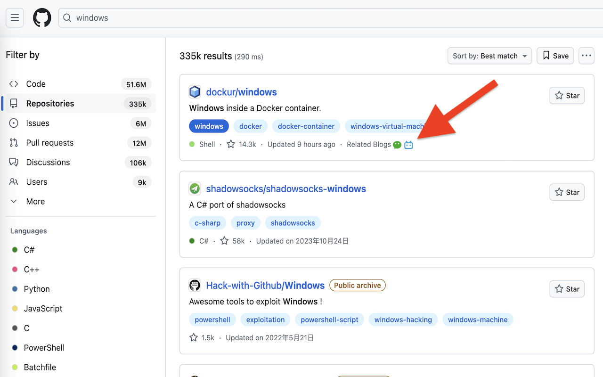

# GitHub Linker Extension

Show repo related info in GitHub page, like blog, video, similar project etc.

This is an official repo for <a href="https://chromewebstore.google.com/detail/github-linker/onibhfpjiiendmejmgccflkcjhifgbgn">GitHub Linker extension</a>

## Screenshots

#### Repo Page

install extension and visite url https://github.com/dockur/windows

#### Trending Page

url: https://github.com/trending

#### Search

url: https://github.com/search?q=windows&type=repositories

## Installation

Click <a href="https://chromewebstore.google.com/detail/github-linker/onibhfpjiiendmejmgccflkcjhifgbgn">GitHub Linker extension</a> to Chrome online install, or Click [GitHub Release](https://github.com/ZhuPeng/github_linker/releases) to download with local install.
